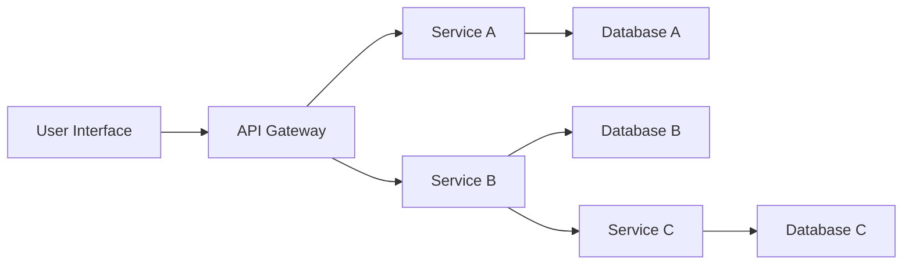

# Microservices Diagram

This document outlines the flowchart and details of the microservices architecture employed in the application. The diagram provides a high-level view of the interactions between different services.

## Flowchart

## Microservice Details

1. **Service A**: Responsible for managing user data and interactions.
   - **Endpoints**: `/users`, `/login`
   - **Database**: Database A (Relational)

2. **Service B**: Handles product information and inventory management.
   - **Endpoints**: `/products`, `/inventory`
   - **Database**: Database B (NoSQL)

3. **Service C**: Provides order processing and management functionalities.
   - **Endpoints**: `/orders`, `/checkout`
   - **Database**: Database C (Relational)